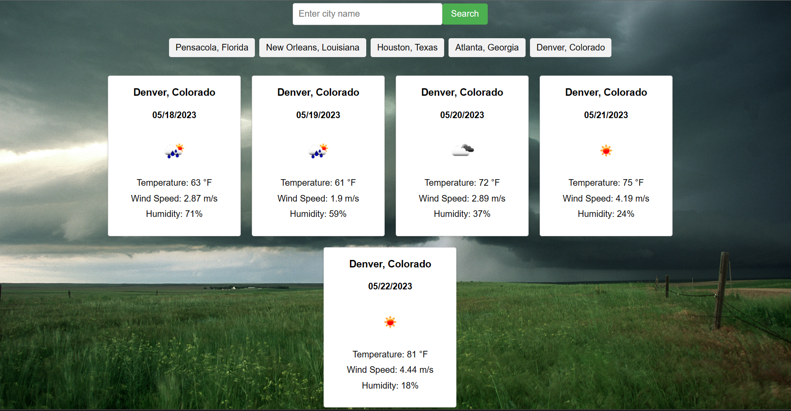

# Your Five Day Forecast

This application is meant to be your weather side-kick. Type in your desired city and state and watch the app do the rest.

## Key Features

This weather app comes with built in local storage that will remember the city you typed in so you do not need to type in your city everytime you visit. You will also be able to see your current five day forecast. Each day will provide you with the wind speed, humidity, and ofcourse the temperature. 

## Getting Started

Go ahead and get started by clicking [here](https://j-sniff.github.io/Weather-Chaser/). Once you are at the page simply type in your city and state and let the page do the rest. Type in other cities you are interested in and they will be saved for later searches. 

## Support

If you notice any issues with the application or simply need some support. Please contact me using the following options.

- JacobS@email.com
- Jacob Sniff on Slack, Discord, and GitHub.